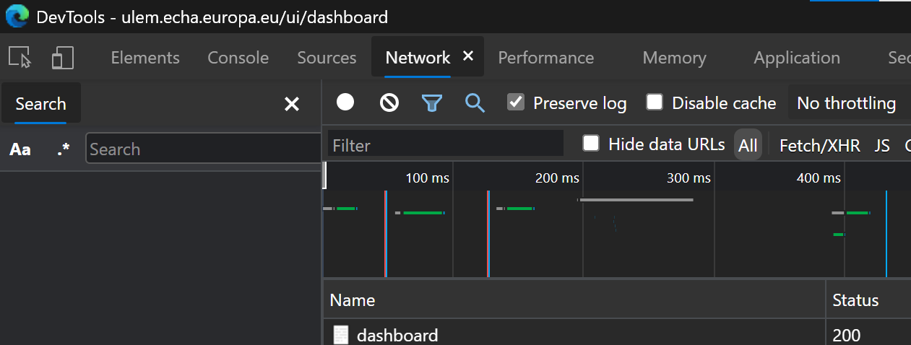
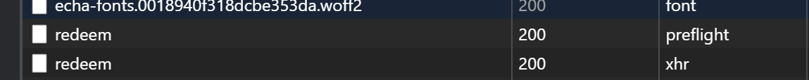
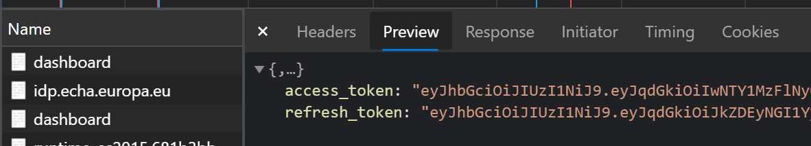

# IDM based setup of report generator script

## Background

Basic IUCLID authentication method does not work when the IUCLD instance is hosted in the ECHA Cloud services. Cloud instances depend on IDM or ECHA account management. The script implements a mechanism to run in these instances but a with a few limitations:

* Manual work required to find the credentials
* The setup is only valid temporarily, the credentials provided to the script may expire in the middle of the execution of large batches of datasets and dossiers.

## Extra requirements

* An account with access to EFSA/ECHA Cloud subscription
* The EFSA/ECHA Cloud instance is up and running

## Setup of the script

Refer to main [README](../README.md)

## Customisation of the .env file for generation

The customisation of the .env file is as in the main [README](../README.md) but for the first step, i.e., the credentials to log in are set differently.

Instead of setting RF_USERNAME and RF_PASSWORD variables, you need to set up RF_TOKEN.

```
export RF_TOKEN=<IDM redeemed access token>
```

## Obtaining the IDM access token from the browser

1. Open your browser
1. Start the browser developer tools (Ctrl+Shift+I)
1. Access your ECHA account management page from the browser tab, aka [ULEM](https://ulem.echa.europa.eu/ui/dashboard)
1. In the developer tools select the Network tab

1. Click on the second "redeem" entry in the list to the left of the Network tab

1. Click on the Preview tab of the redeem entry

1. Copy the access content value to the  RF_TOKEN entry in the .env file

## Run and generate the report

In the 'Git Bash' termninal, the refresh-and-generate.sh script needs to include a new flag, --idm, e.g.:

```
./refresh-and-generate.sh pcn_html_report.env --diff --idm
```

Remember that you need to update the .env file with  a fresh IDM access token before running the script. It expires every 10 minutes approximately.
